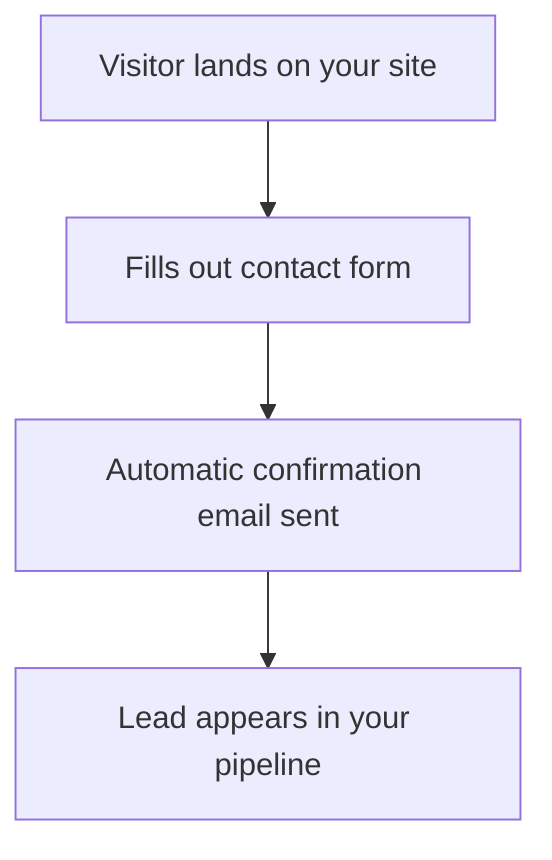

# TransformWebsites Client Help Center

## What is this repository?

This repository (`Chamelio-agency/documentationai-Docs`) is the **client-facing help center** for TransformWebsites, published via **Documentation.AI**. Any `.mdx` file pushed to this repo automatically becomes a live, searchable documentation page with a built-in AI assistant.

Clients use this to learn how to manage their website, use their Growth Tools (GoHighLevel), and find answers before messaging Korneel on Slack.

**How it works:** Write `.mdx` files with YAML frontmatter, commit, push. Documentation.AI publishes them with search, navigation, and an AI chatbot automatically.

---

## Quick Commands

### "Add a help article about [X]"
Create a new `.mdx` file in the correct folder, following the article format below. Commit and push.

### "Update the help docs for [X]"
Find the relevant article, update it with the new information, commit and push.

### "Turn this Loom transcript into documentation"
Take the provided Loom transcript, clean it up into a well-structured help article. Embed the Loom video using the `<Video>` component. Write the full SOP from the transcript so clients can follow by reading. Commit and push.

---

## Tone and Style

- **Warm and conversational.** Write as if explaining to a smart friend who isn't technical.
- **Second person.** Use "you" and "your" throughout.
- **No jargon.** Use these substitutions:
  - "CMS" → "your content dashboard"
  - "deploy" → "publish"
  - "DNS" → "domain settings"
  - "CDN" → "servers around the world" or explain in plain language
  - "SSL" → "the security padlock in your browser"
  - "repository" → never mention, it's invisible to clients
  - "commit/push" → never mention, clients don't interact with git
  - "API" → "connection" or "integration" depending on context
  - "webhook" → "automatic notification"
  - "GROQ/query" → never mention
- **Short paragraphs.** 2-3 sentences max per paragraph.
- **Practical.** Every article should answer one question completely. Don't ramble.
- **Encouraging.** These clients are wellness entrepreneurs, not developers. Make them feel capable.

---

## Article Format

Every article follows this structure in `.mdx` format:

```mdx
---
title: Clear Title That Matches What a Client Would Search For
description: One sentence summary for SEO and the AI assistant (120-160 characters)
---

# Clear Title That Matches What a Client Would Search For

One to two sentence summary of what this page covers and why it matters to you.

<Video
  src="https://www.loom.com/embed/VIDEO_ID"
  title="Walkthrough: [Topic]"
  width="672"
  height="378"
  allow-full-screen="true"
  style="width: 100%; max-width: 672px; height: auto;"
/>

## First Section

Content with clear, numbered steps where applicable.

## Next Section

More content.

---

> **Need help?** If you get stuck, send Korneel a message on Slack and we'll sort it out together.
```

---

## Loom Video Embeds

Documentation.AI uses the `<Video>` component for embedding Loom videos (NOT markdown links):

### Full video embed at top of article
```mdx
<Video
  src="https://www.loom.com/embed/VIDEO_ID"
  title="Walkthrough: How to edit your pages"
  width="672"
  height="378"
  allow-full-screen="true"
  style="width: 100%; max-width: 672px; height: auto;"
/>
```

### Placeholder when Loom isn't recorded yet
Use this comment so Korneel can find and replace later:
```mdx
{/* LOOM: Record a walkthrough showing [specific description of what to cover] */}
```

### Linking to a specific timestamp within text
```mdx
[Watch this step (0:42)](https://www.loom.com/share/VIDEO_ID?t=42)
```

### When Korneel provides a Loom transcript
1. **Clean up the transcript** into clear, structured prose — remove filler words, false starts, and repetition
2. **Break it into logical sections** that match the chapter structure from the Loom video
3. **Embed the Loom video** at the top of the article using the `<Video>` component above
4. **Link to specific timestamps** within the article where a visual walkthrough helps
5. **Write the full SOP** from the transcript — don't just embed the video. Clients should be able to follow the steps by reading, with the video as optional support.

---

## Soft Upsell Notes

For articles about features that are part of a specific package or add-on, include a gentle note at the bottom (before the "Need help?" footer):

```mdx
---

> This feature is part of our **Growth Tools** package. Interested in adding it to your setup? Send Korneel a message on Slack and we'll walk through whether it's a good fit for your business.
```

Never be pushy. The documentation is the menu — clients browse and come to you when they're ready.

---

## Cross-Linking

Link between related articles wherever it's natural. Examples:
- A forms article should link to the automations article when mentioning follow-up emails
- The care plan article should link to the "requesting changes" article
- Analytics articles should link to the relevant setup articles

Use absolute paths from docs root: `[Learn more about automations](/growth-tools/automations/overview)`

---

## Commit Conventions

```
docs: add [brief description]
docs: update [brief description]
docs: fix [brief description]
```

Examples:
```
docs: add social planner scheduling guide
docs: update care plan article with new pricing
docs: add email marketing walkthrough from Loom transcript
```

---

## File Organization

```
getting-started/           # Onboarding and orientation
website-management/        # Sanity CMS how-tos
hosting-care-plan/         # Plans, reports, requesting changes
growth-tools/
  social-planner/          # Social media scheduling
  forms-surveys/           # Forms and intake questionnaires
  automations/             # Email sequences and workflows
  pipeline-crm/            # Lead tracking and contacts
  reviews/                 # Review collection and management
  email-marketing/         # Campaigns and newsletters
  calendar-booking/        # Online scheduling
  ai-features/             # AI chatbot
analytics/                 # Tracking and conversion data
faq.mdx                    # Standalone FAQ page
```

Each file is `.mdx` with YAML frontmatter (`title`, `description`).

---

## Page Frontmatter Reference

Every `.mdx` file starts with YAML frontmatter:

```yaml
---
title: "Page Title"                    # Required. Used in navigation, browser tab, search, social cards
description: "Brief summary"           # Optional but recommended. 120-160 chars. Used for SEO meta description
---
```

Additional frontmatter fields (set in `documentation.json`, not in files):
- `icon`: Lucide icon name for navigation
- `badge`: Short label like "New" or "Beta" (colored pill)
- `show-sidebar`: Toggle left sidebar (default: true)
- `show-toc`: Toggle right-side Table of Contents (default: true)
- `content-width`: "narrow", "normal" (default), or "wide"

---

## Documentation.AI Component Reference

### Callouts

Five visual styles for highlighting information:

```mdx
<Callout kind="info">
  Neutral information or context.
</Callout>

<Callout kind="tip">
  Helpful suggestions and best practices.
</Callout>

<Callout kind="success">
  Positive confirmations — something worked!
</Callout>

<Callout kind="alert">
  Warnings and cautions — be careful here.
</Callout>

<Callout kind="danger">
  Critical errors and destructive actions.
</Callout>
```

Collapsible callout (starts hidden, click to expand):
```mdx
<Callout kind="info" collapsed="true">
  Optional deep-dive explanation.
</Callout>
```

**For our help center:** Use `tip` for practical advice, `info` for context, `alert` for "don't do this" warnings. Rarely use `danger` or `success`.

---

### Steps

Numbered step-by-step instructions with automatic connecting lines:

```mdx
<Steps>
  <Step title="Log into your content dashboard" icon="log-in" title-type="p">
    Go to yourdomain.com/studio and sign in with your email.
  </Step>
  <Step title="Find the page you want to edit" icon="search" title-type="p">
    Use the sidebar on the left to navigate to the page.
  </Step>
  <Step title="Make your changes and publish" icon="check" title-type="p">
    Edit the fields, then click the green Publish button.
  </Step>
</Steps>
```

**Props:**
- `title` (required): Step heading text
- `icon` (optional): Lucide icon name. Omit for automatic 1, 2, 3 numbering
- `title-type` (optional): `p` (default), `h2`, or `h3`

Steps support rich content inside: text, code blocks, callouts, images, lists.

---

### Cards

Navigation blocks with titles, descriptions, icons, and links:

```mdx
<Card title="Edit Your Pages" icon="pencil" href="/website-management/editing-page-content">
  Learn how to update text, images, and sections on your website.
</Card>
```

**Props:**
- `title` (required): Card heading
- `href` (required): Link destination
- `icon` (optional): Lucide icon name
- `image` (optional): Header image URL
- `cta` (optional): Call-to-action button text
- `horizontal` (optional): Side-by-side layout (`true`/`false`, default false)
- `target` (optional): `_self` (default) or `_blank`

---

### Columns

Responsive multi-column layouts (auto-stacks on mobile):

```mdx
<Columns cols={2}>
  <Card title="Hosting Plan" icon="cloud" href="/hosting-care-plan/hosting-plan">
    EUR 29/month — hosting, SSL, uptime monitoring.
  </Card>
  <Card title="Care Plan" icon="heart" href="/hosting-care-plan/care-plan">
    EUR 99/month — hosting plus content updates and priority support.
  </Card>
</Columns>
```

Supports `cols={2}`, `cols={3}`, or `cols={4}`. Works with Cards, Callouts, Images, and `<div>` wrappers for text content.

| Screen Size | cols={2} | cols={3} | cols={4} |
| --- | --- | --- | --- |
| Mobile | 1 col | 1 col | 1 col |
| Tablet | 2 cols | 2 cols | 2 cols |
| Desktop | 2 cols | 3 cols | 4 cols |

---

### Tabs

Tabbed content switcher:

```mdx
<Tabs>
  <Tab title="Google Calendar" icon="calendar">
    Your booking system syncs automatically with Google Calendar.
  </Tab>
  <Tab title="Outlook" icon="mail">
    Connect your Outlook calendar in Settings → Integrations.
  </Tab>
</Tabs>
```

**Props:**
- `title` (required): Tab label
- `icon` (optional): Lucide icon name

Tabs support any MDX content inside, including callouts, steps, code blocks.

---

### Expandables (Accordions)

Collapsible content sections — perfect for FAQs:

```mdx
<ExpandableGroup>
  <Expandable title="Can I edit my own website?" default-open="false">
    Yes! You have full access to your content dashboard where you can update text, images, and blog posts anytime.
  </Expandable>
  <Expandable title="What if I need a new page?" default-open="false">
    Reach out to Korneel on Slack. Simple pages can often be added as part of your Care Plan.
  </Expandable>
</ExpandableGroup>
```

Single expandable:
```mdx
<Expandable title="Click to see more details" default-open="false">
  Hidden content here.
</Expandable>
```

**Props:**
- `title`: Header text
- `default-open`: `"true"` or `"false"` (default: false)

---

### Video Embeds

For Loom, YouTube, Vimeo, and other video platforms:

```mdx
<Video
  src="https://www.loom.com/embed/VIDEO_ID"
  title="Walkthrough: Editing your website"
  width="672"
  height="378"
  allow-full-screen="true"
  style="width: 100%; max-width: 672px; height: auto;"
/>
```

For self-hosted MP4/WebM files:
```mdx
<Video
  src="https://example.com/video.mp4"
  controls="true"
  poster="https://example.com/thumbnail.jpg"
  style="width: 100%; max-width: 672px; height: auto;"
/>
```

---

### Images

```mdx
<Image
  src="https://your-cdn.com/screenshot.png"
  alt="Screenshot of the content dashboard showing the page editor"
  width="800"
  height="600"
/>
```

**Props:** `src` (required), `alt` (required), `width`, `height`, `style`, `priority` (boolean for above-fold images).

Supported formats: JPEG, PNG, GIF, WebP, SVG. Only absolute URLs. Alt text is mandatory.

---

### Iframes

For embedding external tools, forms, or dashboards:

```mdx
<Iframe
  src="https://example.com/form"
  title="Booking form"
  width="100%"
  height="600"
  style="border: 1px solid #e5e7eb; border-radius: 8px;"
/>
```

---

### Update (Changelog Entries)

Timeline-style blocks for announcements:

```mdx
<Update label="2025-03-15" description="New feature">
  You can now schedule social media posts directly from your dashboard.
</Update>
```

**Props:** `label` (date or version), `description` (subtitle), `tags` (array of badges like `["feature", "improvement"]`).

---

### Mermaid Diagrams

Flowcharts, sequence diagrams, and more:

````mdx

````

Supports: flowcharts, sequence diagrams, class diagrams, state diagrams, ER diagrams, Gantt charts, git graphs. Keep diagrams under 15 nodes.

---

### Tables

Standard Markdown tables:

```markdown
| Feature | Hosting Plan | Care Plan |
| --- | --- | --- |
| Vercel hosting | Yes | Yes |
| SSL certificate | Yes | Yes |
| Content updates | No | Up to 2h/month |
| Monthly reports | No | Yes |
| Priority support | No | Yes |
| **Price** | **EUR 29/month** | **EUR 99/month** |
```

Alignment: `:---` left, `:---:` center, `---:` right.

---

### Lists

```markdown
- Unordered item (use dashes consistently)
- Another item
  - Nested item (indent 2-4 spaces)

1. Ordered item
2. Another ordered item
   1. Nested ordered item
```

---

## documentation.json Configuration

The main config file controlling navigation, branding, and site behavior.

### Key top-level fields:

```json
{
  "name": "TransformWebsites Help Center",
  "initialRoute": "getting-started/welcome",
  "template": "classic",
  "colors": {
    "light": { "brand": "#F97316", "heading": "#1a1a1a", "text": "#374151" },
    "dark": { "brand": "#FDBA74", "heading": "#f2f2f2", "text": "#c1c1c1" }
  },
  "logo-dark": "URL",
  "logo-light": "URL",
  "logo-small-dark": "URL",
  "logo-small-light": "URL",
  "navbar": {
    "actions": {
      "primary": { "title": "Book a Call", "link": "https://..." },
      "links": [{ "title": "Login", "link": "https://..." }]
    }
  },
  "navigation": {
    "tabs": [...]
  }
}
```

### Navigation structure:

```json
{
  "navigation": {
    "tabs": [
      {
        "tab": "Tab Label",
        "icon": "lucide-icon-name",
        "groups": [
          {
            "group": "Group Label",
            "icon": "lucide-icon-name",
            "expandable": true,
            "pages": [
              {
                "title": "Page Title",
                "path": "folder/filename",
                "icon": "lucide-icon-name",
                "badge": "New"
              }
            ]
          }
        ]
      }
    ]
  }
}
```

**Rules:**
- `path` is relative, without `.mdx` extension
- Tabs contain only one type: pages OR groups (don't mix)
- Keep navigation depth under 3 levels
- Icons are from the [Lucide React](https://lucide.dev/icons/) library
- `expandable: false` means the group is always open in sidebar

### Redirects:

```json
{
  "redirects": [
    { "source": "/old-path", "destination": "/new-path", "statusCode": 301 }
  ]
}
```

---

## Lucide Icons Quick Reference

Common icons for our help center:

| Icon | Use for |
| --- | --- |
| `home` | Welcome/landing pages |
| `users` | Team, contacts, CRM |
| `globe` | Website, domains |
| `log-in` | Login, access |
| `pencil` | Editing content |
| `file-text` | Blog posts, documents |
| `image` | Images, media |
| `menu` | Navigation |
| `link` | Domains, connections |
| `activity` | Performance, speed |
| `cloud` | Hosting |
| `heart` | Care plan |
| `bar-chart` | Reports, analytics |
| `message-circle` | Support, chat |
| `share-2` | Social media |
| `calendar` | Scheduling, booking |
| `mail` | Email |
| `zap` | Automations |
| `filter` | Pipeline, CRM |
| `star` | Reviews |
| `cpu` | AI features |
| `trending-up` | Growth, analytics |
| `target` | Conversions, leads |
| `help-circle` | FAQ, help |
| `check-circle` | Confirmations |
| `clock` | Time, availability |
| `settings` | Configuration |
| `send` | Sending, publishing |
| `inbox` | Submissions, received items |
| `search` | Finding, searching |
| `plus-circle` | Creating new items |
| `rocket` | Getting started |

Full library: https://lucide.dev/icons/
